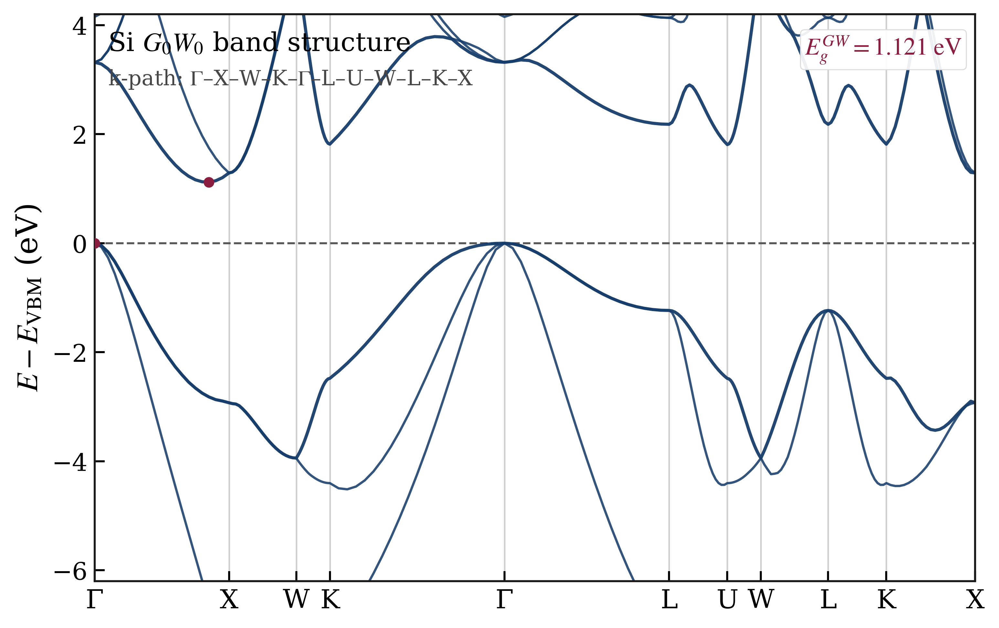

<div align="center">
  
  <p>
    Describe the task in natural language. Let the agent choose the route,
    patch inputs, run checks, execute stage by stage, and report results back in chat.
  </p>

  <p>
    <a href="https://github.com/AroundPeking/oh-my-LibRPA/releases"></a>
    <a href="https://github.com/AroundPeking/oh-my-LibRPA/stargazers"></a>
    <a href="https://github.com/AroundPeking/oh-my-LibRPA/network/members"></a>
    <a href="https://github.com/AroundPeking/oh-my-LibRPA/issues"></a>
    <a href="https://github.com/AroundPeking/oh-my-LibRPA/commits/main"></a>
  </p>

  <p>
    <a href="docs/guide/installation.md"><strong>Installation</strong></a>
    ·
    <a href="docs/guide/chat-guidance.md"><strong>Chat guide</strong></a>
    ·
    <a href="examples/si-k444-gw/README.md"><strong>Si GW example</strong></a>
    ·
    <a href="#what-you-get"><strong>What you get</strong></a>
  </p>
</div>

---

## What this is

`oh-my-LibRPA` is an **AI experience layer** for `ABACUS + LibRPA`.

The idea is simple:

- users should talk in **natural language**, not memorize workflow commands
- the agent should understand whether the case is **molecule / solid / 2D**
- the workflow should follow **curated experience**, not ad-hoc guessing
- expensive runs should still respect **fresh directories**, **static checks**, and **stage-by-stage validation**

In practice, that means the agent can help with:

- preparing GW / RPA inputs
- auditing uploaded bundles instead of blindly rewriting them
- catching route mismatches before remote execution
- running and reporting each critical stage
- producing a final scientific artifact such as a **paper-style GW band plot**

> [!TIP]
> Think of it as a chat-native workflow harness for real ABACUS + LibRPA work — not just a pile of templates.

---

## Quick start

### 1. Install via AI

Copy this into your AI assistant:

```text
Install and configure oh-my-LibRPA by following:
https://raw.githubusercontent.com/AroundPeking/oh-my-LibRPA/main/docs/guide/installation.md
```

### 2. Install manually

```bash
curl -fsSL https://raw.githubusercontent.com/AroundPeking/oh-my-LibRPA/main/install.sh | bash
```

For local development:

```bash
cd ~/code/oh-my-librpa
bash install.sh
```

### 3. Start chatting

Example prompts:

- `Help me run GW for GaAs with a conservative setup first.`
- `This is a molecular system. Prepare inputs using the molecular route.`
- `How do we fix this error? Give me the minimal repair action.`
- `Mirror an existing FHI-aims + LibRPA QSGW case and stage a new k-point sweep first.`

### Update an existing install

After the first install, use the in-place updater instead of repeating the full install flow:

```bash
~/.openclaw/workspace/oh-my-librpa/update.sh
```

If the local updater is missing:

```bash
curl -fsSL https://raw.githubusercontent.com/AroundPeking/oh-my-LibRPA/main/update.sh | bash
```

For Windows + Git Bash agent updates, see:

- [`docs/guide/windows-git-bash.md`](docs/guide/windows-git-bash.md)

---

## What you get

### Chat-first orchestration

- single entry-point skill: `oh-my-librpa`
- stack-layer skill: `oh-my-librpa-abacus-librpa`
- stack-layer skill: `oh-my-librpa-fhi-aims-qsgw`
- file-first intake for structures, inputs, logs, and archives
- compute-location handshake before expensive work starts
- route selection by `molecule`, `solid`, or `2D`

### Route-aware workflow logic

- **molecular GW** short route
- **periodic GW** full route
- **periodic GW symmetry** lane with ABACUS sidecars staged for LibRPA
- **RPA** split from GW-only preprocessing
- **FHI-aims + LibRPA QSGW/G0W0** supplement for case mirroring and staged campaigns
- spin / SOC consistency checks across helper scripts and `librpa.in`

### Safety + reproducibility

- new isolated run directory per run chain
- when reusing an old case, copy only source inputs and helper scripts into the new run directory; never carry over generated outputs such as `OUT.ABACUS`, `band_out`, `coulomb_*`, `LibRPA*.out`, `librpa.d`, `time.json`, or old GW data
- static preflight before remote execution
- Markdown run reports written both in-run and to archive
- stage-by-stage reporting for SCF / pyatb / NSCF / preprocess / LibRPA

### Reusable assets

- curated rule cards
- route-aware templates
- workflow helpers for preflight, checks, execution, and reporting
- bundled plotting helper for periodic GW results
- example server-profile conventions for reproducible runtime setup

---

## Workflow lanes

```text
Molecule GW:      SCF -> LibRPA
Periodic GW:      SCF -> pyatb -> NSCF -> preprocess -> LibRPA
Periodic GW sym:  SCF(symmetry=1,rpa=1) -> copy sidecars -> pyatb -> NSCF(symmetry=-1) -> preprocess -> LibRPA(symmetry flags)
RPA:              SCF -> LibRPA
```

The agent should decide the lane from the user's files, intent, and system type — then explain what it is doing and why.

---

## Documentation map

If you only open three pages, open these:

| Page | What it is for |
| --- | --- |
| [`docs/guide/installation.md`](docs/guide/installation.md) | Full install flow for agents and humans |
| [`docs/guide/chat-guidance.md`](docs/guide/chat-guidance.md) | What the user should say, what the agent should ask, and how the interaction should feel |
| [`examples/si-k444-gw/README.md`](examples/si-k444-gw/README.md) | A realistic periodic GW walkthrough with final output expectations |

Useful supporting material:

| Path | Purpose |
| --- | --- |
| `skills/` | Chat-facing skills |
| `docs/guide/fhi-aims-librpa-qsgw.md` | Supplemental route for `FHI-aims + LibRPA` QSGW/G0W0 cases |
| `rules/cards/` | Structured experience: scene → symptom → root cause → fix → verify |
| `templates/` | Workflow templates and plotting helpers |
| `scripts/` | Preflight, consistency checks, stage reporting, and workflow runners |
| `references/` | Shared notes such as server-profile conventions |
| `registry/` | Example runtime profiles and registry-style assets |

---

## Example final result

<div align="center">
  
  <br />
  <sub>Paper-style GW band figure generated from a chat-driven periodic GW workflow.</sub>
</div>

### Result pipeline

```text
chat request
  -> route selection
  -> intake / consistency checks
  -> stage-by-stage execution
  -> archived run report
  -> final scientific artifact
```

This is the shape the project is aiming for: not just “some scripts,” but a workflow that is **explainable**, **checkable**, and **pleasant to drive from chat**.

---

## Current MVP scope

- chat orchestrator skill: `oh-my-librpa`
- stack-layer routing skill: `oh-my-librpa-abacus-librpa`
- stack-layer routing skill: `oh-my-librpa-fhi-aims-qsgw`
- core workflow skills: `abacus-librpa-gw`, `abacus-librpa-rpa`, `abacus-librpa-debug`
- rule cards for workflow defaults and repair patterns
- route materialization for molecular GW and generic periodic lanes
- intake / preflight / consistency helper scripts
- stage-aware GW and RPA runners
- Markdown run logging in both run directory and archive
- self-test after install/update
- periodic GW plotting helper for compact paper-style figures

---

## Repository layout

```text
oh-my-librpa/
|-- skills/
|   |-- oh-my-librpa/
|   |-- oh-my-librpa-abacus-librpa/
|   |-- abacus-librpa-gw/
|   |-- abacus-librpa-rpa/
|   |-- oh-my-librpa-fhi-aims-qsgw/
|   `-- abacus-librpa-debug/
|-- references/
|-- rules/cards/
|-- templates/
|-- scripts/
|-- examples/
|-- registry/
`-- docs/
```

---

## Design principles

- **Chat-first** — users should not memorize custom workflow commands
- **Experience-driven** — curated rules are preferred over ad-hoc prompting
- **Route-aware** — molecule, solid, and 2D cases should not be treated as the same workflow
- **Extension-friendly** — keep the ABACUS mainline intact while adding supplemental routes for other DFT stacks such as FHI-aims
- **Safety-first** — fresh run directories, static checks first, no silent overwrite of source data
- **Report what happened** — every important stage should say what was done, what was observed, and what is next

---

## Safety constraints

- prefer static checks before remote execution
- every run chain must use a new isolated directory
- never overwrite original data directories
- for expensive or long jobs, confirm compute location and resource choice first

---

## One-line pitch

> **oh-my-LibRPA turns ABACUS + LibRPA workflow knowledge into a chat-native, route-aware, safety-conscious agent layer.**
